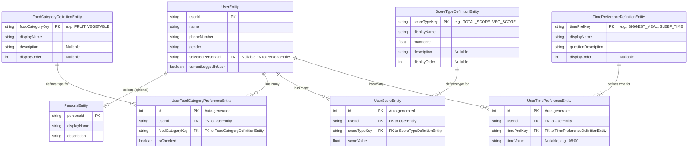

# Refactored Database Schema (Normalized)

This diagram represents the relationships between different entities in the refactored and more normalized database.

## Entity Descriptions

### Core Entities
-   **UserEntity**: Main user table.
-   **PersonaEntity**: Defines available user personas.

### Definition Tables (Metadata)
-   **FoodCategoryDefinitionEntity**: Defines all possible food categories (e.g., "FRUIT", "VEGETABLE") and their properties.
-   **ScoreTypeDefinitionEntity**: Defines all possible score types (e.g., "TOTAL_SCORE", "VEGETABLES") and their properties like `maxScore`.
-   **TimePreferenceDefinitionEntity**: Defines all types of time-related preferences (e.g., "BIGGEST_MEAL", "SLEEP_TIME").

### User-Specific Data Tables (Normalized)
-   **UserFoodCategoryPreferenceEntity**: Links a user to a food category they have a preference for. A user can have multiple entries (one per category). `isChecked` indicates their preference.
-   **UserScoreEntity**: Stores a specific score type and its value for a user. A user can have multiple score entries.
-   **UserTimePreferenceEntity**: Stores a specific time preference (e.g., sleep time) for a user. A user can have multiple time preference entries.

## Advantages of this Refactored Design
1.  **Normalization**: Reduces data redundancy and improves data integrity.
2.  **Flexibility & Scalability**: Easier to add new food categories, score types, or time preferences by adding rows to definition tables without schema changes to user data tables.
3.  **Single Source of Truth for Types**: Definition tables act as the master list for all categories, scores, and time preference types.
4.  **Improved Querying**: Facilitates more complex queries (e.g., "average score for VEGETABLES across all users").
5.  **Clear Relationships**: Standard one-to-many relationships are clearer and easier to manage with Room and DAOs using `@Relation`. 