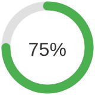

# NutriTrack API Reference

_This document provides a **high–level reference** for all publicly exposed classes, data-structures, functions, and Jetpack Compose components that make up the NutriTrack application. Each entry lists the **package**, a short **description**, a table of the most relevant public members, and **code snippets** showing canonical usage._

> **Legend**  
> • `C` = Class / Interface / Object  
> • `F` = Function / Method  
> • `V` = `val` / `var` (property)  
> • 🗄 = Data class / Entity  
> • ⚙️ = Utility  
> • 🎨 = UI Component  
> • 📊 = View-Model  

---

## 1 · Core Application Entry Points

| Symbol | Kind | Signature | Purpose |
|--------|------|-----------|---------|
| `MainActivity` | C | `class MainActivity : ComponentActivity` | Single–activity host that sets up Navigation and injects `NutriTrackApp`. |
| `NutriTrackApp` | C | `@Composable fun NutriTrackApp()` | Root Jetpack Compose host applying `NutriTrackTheme`, NavGraph, etc. |

**Usage**
```kotlin
class MainActivity : ComponentActivity() {
    override fun onCreate(savedInstanceState: Bundle?) {
        super.onCreate(savedInstanceState)
        setContent { NutriTrackApp() }
    }
}
```

---

## 2 · Navigation

| Symbol | Kind | Signature | Purpose |
|--------|------|-----------|---------|
| `Screen` | 🗄 | `sealed class Screen(val route: String)` | Type-safe route constants – avoids hard-coded strings. |
| `NavGraph` | F | `@Composable fun NavGraph(navController: NavHostController)` | Centralised navigation graph wiring every screen. |

_Navigation is driven by `Screen` objects rather than raw routes:_
```kotlin
navController.navigate(Screen.Home.route)
```

---

## 3 · Data Layer (Room)

> Location: `com.example…data.model`

### 3.1 · Entities 🗄

| Entity | Fields |
|--------|--------|
| `UserEntity` | `id`, `name`, `gender`, `avatarUrl` … |
| `PersonaEntity` | `personaId`, `title`, `description` |
| `FoodCategoryDefinitionEntity` | `id`, `name`, `emoji` |
| `UserTimePreferenceEntity` | `userId`, `timeOfDay` |
| `UserScoreEntity` | `userId`, `scoreTypeId`, `scoreValue`, `timestamp` |
| *etc.* |

### 3.2 · DAO Interfaces

| DAO | Key Functions |
|-----|---------------|
| `UserDao` | `getUsers()`, `insert(user)`, `delete(user)` |
| `ChatMessageDao` | `streamAll()`, `insert(msg)` |
| *…* | |

_All DAO methods are `suspend` functions and therefore must be called from a Coroutine scope._

### 3.3 · Repository façade

Repositories provide a clean API for the rest of the app:
```kotlin
val repo = UserRepository.get(appDatabase)
val currentUser = repo.fetchUser(userId)
```

---

## 4 · Network Layer (Retrofit)

| Symbol | Kind | Signature | Purpose |
|--------|------|-----------|---------|
| `FruitViceService` | C | `interface FruitViceService` | Low-level Retrofit interface for FruityVice REST API. |
| `FruitViceRepo` | C | `class FruitViceRepo` | High-level wrapper – handles errors & maps DTOs → domain model. |
| `FruityViceApiDto` | 🗄 | API DTO exactly matching JSON from service. |
| `FruitResponse` | 🗄 | Sanitised domain object returned to the UI. |

**Fetching a fruit**
```kotlin
val repo = FruitViceRepo.getRepository()
viewModelScope.launch {
    val info = repo.getFruitDetails("banana")
}
```

**Example API response (`banana`)**
```json
{
  "genus": "Musa",
  "name": "Banana",
  "id": 1,
  "family": "Musaceae",
  "order": "Zingiberales",
  "nutritions": {
    "carbohydrates": 22,
    "protein": 1,
    "fat": 0.2,
    "calories": 96,
    "sugar": 17.2
  }
}
```

---

## 5 · Utilities ⚙️

| Utility | Key APIs |
|---------|----------|
| `InitDataUtils` | `insertFoodCategories(db)`, `insertScoreTypes(db)` – one-shot DB seed helpers. |
| `EncryptionUtils` | `encrypt(data, key)`, `decrypt(data, key)`. |
| `SharedPreferencesManager` | Kotlin property accessors around Android `SharedPreferences`. |
| `ScoreUtils` | `calculate(nutritionScores) → Double`, formatter helpers. |
| `ImageUtils` | `loadBitmapFromAssets(context, file)`. |

```kotlin
val encrypted = EncryptionUtils.encrypt("secret", passphrase)
```

---

## 6 · View-Models 📊 (MVVM)

| ViewModel | Primary Responsibilities |
|-----------|--------------------------|
| `AuthViewModel` | Handles login/registration and session state. |
| `ClinicianDashboardViewModel` | Aggregates user stats for clinician UI. |
| `FruitViewModel` | Wraps `FruitViceRepo` for Compose screens. |
| `GenAIViewModel` | Streams responses from OpenAI-style API for chat. |
| `QuestionnaireViewModel` | Persists questionnaire answers and derives scores. |
| `UserStatsViewModel` | Misc user metrics & trend analysis. |

Each ViewModel exposes explicit `UiState` objects as **StateFlow** / **MutableState** for Compose to observe.

```kotlin
val viewModel: AuthViewModel = viewModel()
val uiState by viewModel.uiState.collectAsState()
```

**Implementation sketch – `AuthViewModel`**
```kotlin
class AuthViewModel(
    private val userRepo: UserRepository,
    private val dispatcher: CoroutineDispatcher = Dispatchers.IO
) : ViewModel() {

    private val _uiState = MutableStateFlow<UiState>(UiState.Initial)
    val uiState: StateFlow<UiState> = _uiState.asStateFlow()

    fun login(userId: String, password: String) {
        viewModelScope.launch(dispatcher) {
            _uiState.value = UiState.Loading
            runCatching {
                userRepo.login(userId, password)
            }.onSuccess {
                _uiState.value = UiState.Success("Welcome back $userId!")
            }.onFailure { throwable ->
                _uiState.value = UiState.Error.ApiError(throwable.message ?: "Unknown error")
            }
        }
    }
}
```
This pattern is mirrored across other ViewModels—each exposes a read-only `StateFlow` and mutates its backing state from within `viewModelScope` on the appropriate dispatcher.

---

## 7 · Jetpack Compose Components 🎨

| Component | Preview | Description |
|-----------|---------|-------------|
| `ScoreProgressBar` |  | Radial progress bar visualising nutrition score. |
| `TimePickerComponent` |  | Reusable wheel picker for hour/minute selection. |
| `NavigationBars` | – | Bottom / side navigation bars for mobile & tablet. |
| `PersonaCard` | – | Card with name, emoji & score spark-line. |
| `InfoCard` | – | Generic card with icon + text. |

**Compose sample**
```kotlin
ScoreProgressBar(
    progress = 0.75f,
    label = "75%"
)
```

> All components respect `Modifier` parameters and adopt colours from `NutriTrackTheme`.

---

## 8 · Screens (UI flow)

Screens are top-level `@Composable` functions registered in `NavGraph`.

| Screen | Route | ViewModel |
|--------|-------|-----------|
| `WelcomeScreen` | `welcome` | – |
| `LoginScreen` | `login` | `AuthViewModel` |
| `RegisterScreen` | `register` | `AuthViewModel` |
| `HomeScreen` | `home` | `UserStatsViewModel` |
| `CoachScreen` | `coach` | `GenAIViewModel` |
| `ClinicianDashboardScreen` | `clinician_dash` | `ClinicianDashboardViewModel` |
| `InsightsScreen` | `insights` | `InsightsViewModel` |
| `QuestionnaireScreen` | `questionnaire` | `QuestionnaireViewModel` |
| `SettingsScreen` | `settings` | `ProfileViewModel` |

Navigation example:
```kotlin
Button(onClick = { navController.navigate(Screen.Settings.route) }) {
    Text("Settings")
}
```

---

## 9 · Theming

`view.theme` provides application-wide colours, typography, and shapes. Use `NutriTrackTheme` to automatically apply them.

```kotlin
NutriTrackTheme(darkTheme = isSystemInDarkTheme()) {
    // screens here
}
```

---

## 10 · Extending / Contributing

1. Add new database tables ⇒ create *Entity* + *Dao* + *Repository*, then migrate `AppDatabase`.
2. Add a screen ⇒
   - Create `@Composable fun NewFeatureScreen()` in `view/screens`.
   - Register route in `Screen` sealed class and `NavGraph`.
   - Provide a ViewModel where appropriate.
3. Generate docs ⇒ run `./gradlew dokkaHtml` (Dokka already configured via `build.gradle.kts`).

---

## Appendix A · Room DB Schema

Full ER-diagram and column definitions live in `data/model/database_schema.md`.

---

© 2025 NutriTrack. Licensed under the MIT License.