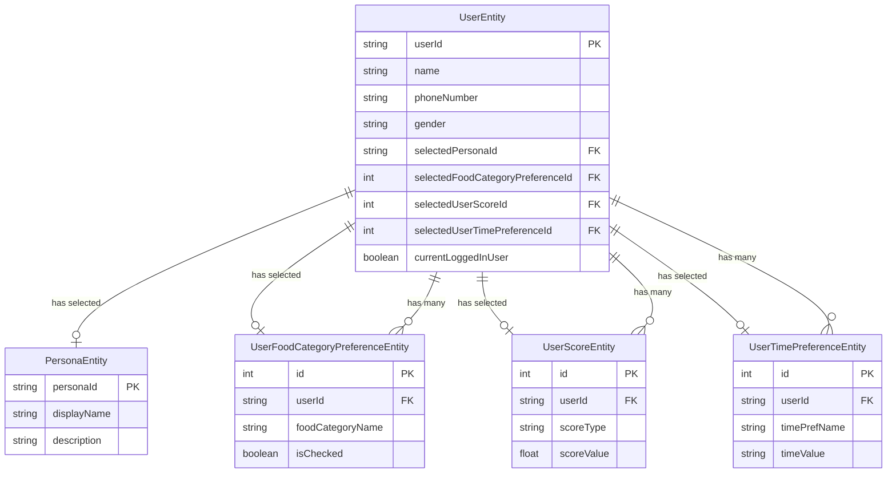

# Database Schema

This diagram represents the relationships between different entities in the NutriTrack database.

## Entity Descriptions

### UserEntity
- Primary entity representing users in the system
- Contains basic user information (name, phone, gender)
- Has direct references to selected preferences and scores
- Can have multiple food preferences, scores, and time preferences

### PersonaEntity
- Represents different user personas (e.g., "Balanced Eater", "Fitness Enthusiast")
- Users select one persona during questionnaire

### UserFoodCategoryPreferenceEntity
- Stores user's food category preferences
- Each user can have multiple food category preferences
- One preference can be selected as primary

### UserScoreEntity
- Stores various nutrition scores for users
- Each user can have multiple scores of different types
- One score can be selected as primary

### UserTimePreferenceEntity
- Stores user's time preferences
- Each user can have multiple time preferences
- One preference can be selected as primary

## Relationships
- One-to-One (or Zero): User to selected Persona
- One-to-One (or Zero): User to selected Food Category Preference
- One-to-One (or Zero): User to selected Score
- One-to-One (or Zero): User to selected Time Preference
- One-to-Many: User to Food Category Preferences
- One-to-Many: User to Scores
- One-to-Many: User to Time Preferences 